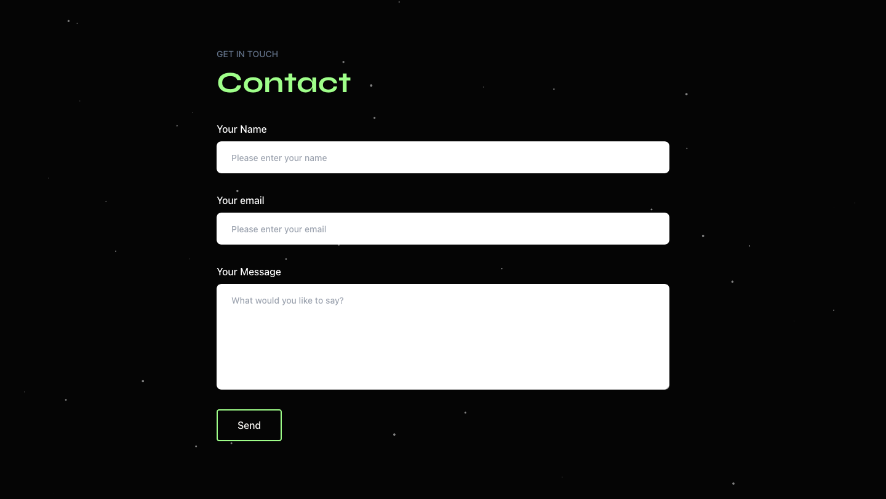

# My Personal Website

#### This is the repository for my personal website 👨‍💻

_Note: This is version 2, which is the current version of my website._

## Table of contents

- [Overview](#overview)
  - [Description](#description)
  - [Goals](#goals)
  - [Screenshots](#screenshots)
  - [Links](#links)
- [My process](#m)
  - [Technology used](#technology-used)
- [Credit](#credit)
  - [Assets](#assets)
  - [Inspiration](#inspiration)

## Overview

### Description

I want a small corner of the internet that I can call my own, this is that place. Previously I already had a personal website, but decided it was due for an upgrade, hence comes this new version v2.

### Goals

1. Update the design from v1 to something more personalized
2. Provide information about myself & my coding journey
3. Display the work I am most proud of in my project section
4. Have a contact form for people to message me

### Screenshots

### Links

- Live Site: [geoffjamieson.com](https://www.geoffjamieson.com/)

## My process

### Technology used

- Vite
- React
- Tailwind
- three.js
- React Three Fiber
- tsParticles
- EmailJS

## Credit

### 🧱Built With

<<<<<<< Updated upstream
- Vite
- React
- TailwindCSS
- three.js
- React Three Fiber
- tsParticles
- EmailJS

### 🖼️ Assets

"Cyber Spore" (https://skfb.ly/oJW97) by Tycho Magnetic Anomaly is licensed under Creative Commons Attribution (http://creativecommons.org/licenses/by/4.0/).
=======
"Cyber Spore" (https://skfb.ly/oJW97) by Tycho Magnetic Anomaly is licensed under Creative Commons Attribution (http://creativecommons.org/licenses/by/4.0/).

### Inspiration

- [Brittany Chiang](https://brittanychiang.com/) - *The design of the website is so nice and clean ... and I love the colour scheme! Also the little teleporter phone booth in the bottom right is such a cool idea, and what inspired me to create a v2 of my own website.*
>>>>>>> Stashed changes
